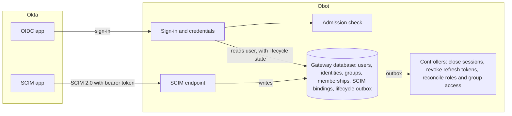
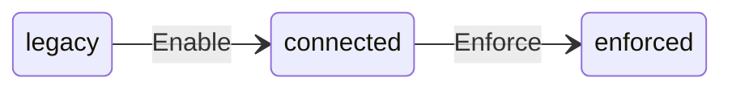

# 2026-09-23: SCIM Support for Okta

- **Authors:** @g-linville
- **Created:** 2026-09-23

## Summary

Support SCIM provisioning from Okta to Obot for users, groups, and group memberships.
Rather than Obot querying Okta for information about these things, Okta will provide
this information to Obot via SCIM 2.0.

Owners will be able to configure SCIM. Obot's SCIM server will act as a facade over its
existing users, identities, groups, and group memberships.

## Related issues

- https://github.com/obot-platform/field-issues/issues/38

## Related ODPs

None.

## Problem and motivation

Obot currently has to query Okta using an API key in order to get information about groups
and group memberships. Some security teams would likely prefer for Okta to control which
groups Obot can see, rather than allowing Obot to see all of them.

SCIM is the industry standard method for using an IdP to provision users and groups in
a downstream application.

## Goals

- Okta provisions users, account status, groups, and group memberships to Obot through SCIM 2.0. Each change applies in Obot when Okta sends it.
- Existing Okta users and groups keep their IDs. Roles, memberships, owned resources, and every policy subject string are unchanged.
- Deactivating a user in Okta denies them access on every credential path, closes their open sessions, and deletes nothing. Reactivating them restores the same account and data.
- No user is dropped. Users that Okta never provisions keep their accounts but cannot sign in once SCIM is enforced. Provisioning them later re-enables them.
- SCIM configuration is a clear two step process: Enable it to begin provisioning, and Enforce it to prevent unprovisioned users from accessing Obot. The Owner configuring SCIM can clearly see what will happen before enablement and enforcement.
- Once SCIM is enabled, the Okta provider serves sign-in without Management API credentials.
- The Okta provider can be deconfigured and reconfigured without losing SCIM data, and SCIM resumes in its recorded state.
- Shared SCIM code stays provider-neutral. Supporting another provider means registering an adapter, which is a clear interface in the code.

## Non-goals

- Support for providers other than Okta at this time (support for others will be added in the future though)
- Registering an official Obot integration in the Okta Integration Network (OIN)
  - We will instead have documentation explaining how to set up custom apps to integrate with Obot
- Returning a provider to login-time directory synchronization after Enable.
- More than one SCIM connection per installation. Obot configures one auth provider at a time.
- Password synchronization, nested groups, bulk requests, `/Me`, `.search`, sorting, ETags, SCIM 1.1, and entitlements.
  - These are SCIM features not needed or supported by Okta and/or Obot
- Setting Obot roles (i.e. Basic, Auditor, Admin, Owner) from SCIM. Roles still come from group role assignments, explicit role emails, and the default role.
- Creating Okta accounts from Obot, or letting Okta import Obot data.
- Blocking a SCIM-managed user in Obot independently of Okta.
- Users and groups of local auth or any other provider. SCIM never changes them.

## Context and constraints

### Existing behavior

| Area | Behavior today | Consequence for this design |
| --- | --- | --- |
| Directory model | [`User`](https://github.com/obot-platform/obot/blob/main/pkg/gateway/types/users.go), [`Identity`](https://github.com/obot-platform/obot/blob/main/pkg/gateway/types/identity.go), and [`Group` and `GroupMemberships`](https://github.com/obot-platform/obot/blob/main/pkg/gateway/types/group.go) are gateway database models. Memberships are keyed by local user ID and full group ID. Roles, resource ownership, and every policy type reference these IDs. | SCIM must write these tables, not a separate store. |
| Okta IDs | The Okta provider names groups `okta/<native-group-id>`. Identities store the native Okta user ID as the provider user ID, and users store it as their username. | Binding must keep whatever ID a group already has. |
| User creation | [`EnsureIdentityWithRole`](https://github.com/obot-platform/obot/blob/main/pkg/gateway/client/identity.go) creates users just in time at sign-in, under a seat-limit lock. | SCIM creates users through the same seat-checked path. After Enforce, sign-in stops creating users. |
| Group sync | [`ensureGroups`](https://github.com/obot-platform/obot/blob/main/pkg/gateway/client/group.go) refreshes memberships from Okta on browser requests, at most every ten minutes. `ListAuthGroups` and `ResolveAuthGroups` ask Okta when admins browse groups or resolve IDs. The local group table is partial: it knows only groups whose members signed in, and its names can be stale. | All three stop for a SCIM-managed provider. |
| Deletion | [`DeleteUser`](https://github.com/obot-platform/obot/blob/main/pkg/gateway/client/user.go) soft-deletes the user, rewrites their email and username, removes their memberships, and schedules [resource cleanup](https://github.com/obot-platform/obot/blob/main/pkg/controller/handlers/cleanup/user.go). | Deactivation is a new operation that never calls it. Users may be deleted after they have been deactivated. |
| Credentials | [`UserDecorator`](https://github.com/obot-platform/obot/blob/main/pkg/gateway/client/auth.go) does not wrap every authenticator. [API keys](https://github.com/obot-platform/obot/blob/main/pkg/gateway/server/apikey_auth.go), [persistent tokens](https://github.com/obot-platform/obot/blob/main/pkg/jwt/persistent/persistent.go), MCP OAuth tokens, device and tunnel flows, and hosted-agent keys authenticate on separate paths. Every path that authenticates a user already reads the user's row from the gateway database on each request. Hosted-agent keys are the exception: they take their owner's ID from the controller store. When the user read fails, persistent and MCP OAuth tokens still authenticate, with the groups in the token, and the API key authenticator declines the key, so the request continues to anonymous access. | A deactivated user must be denied on all of them. The admission check can use the existing reads, but a failed read must deny access. |
| Membership events | Membership changes emit events. [MCP group-loss cleanup](https://github.com/obot-platform/obot/blob/main/pkg/controller/handlers/mcpcatalog/usergroupchange.go) and [workspace reconciliation](https://github.com/obot-platform/obot/blob/main/pkg/controller/handlers/poweruserworkspace/poweruserworkspace.go) act on them and can delete resources. | Deactivation must not remove memberships. |.
| Provider cleanup | [Auth-provider cleanup](https://github.com/obot-platform/obot/blob/main/pkg/controller/handlers/cleanup/authprovider.go), added for [#7632](https://github.com/obot-platform/obot/issues/7632), strips a deconfigured provider's group subjects from six policy types and deletes its group data. | For a SCIM-managed provider, that would destroy the group IDs Okta holds. SCIM-related data is retained even after auth provider deconfiguration. |
| Okta provider | Its [manifest](https://github.com/obot-platform/enterprise-providers/blob/main/auth-providers/okta-auth-provider.yaml) requires API Services credentials, and its [startup](https://github.com/obot-platform/enterprise-providers/blob/main/okta-auth-provider/main.go) always builds a Management API client. | The credentials are not necessary when SCIM is enabled. |
| Transactions | The gateway database, SQLite or PostgreSQL, cannot share a transaction with the controller store. | Work that follows a gateway change must be delivered durably after commit. |

### Requirements

- Moving a provider to SCIM is permanent. The provider can still be deconfigured, and configuring it again keeps it in SCIM mode.
- Only the configured Okta provider's users, groups, and memberships are migrated.
- The admin can see what the migration will change before it happens.
- No user is dropped. Users that Okta never provisions are kept but cannot sign in.
- Existing data structures are preserved. SCIM is a facade over the current model, not a new model.
- Users can be deactivated and reactivated.
- Group IDs stay the same in the database and in policies, including the `okta/` prefix.
- SCIM support for other providers must not require changing the shared code.

### Additional considerations regarding Okta

- Okta provides the native Okta user ID when provisioning users with SCIM
- Okta does NOT provide the native Okta group ID when provisioning groups with SCIM
  - As a consequence, Obot will have to match existing groups based on display name only
    - This is okay because overlapping display names can only happen in rare circumstances, and the code will surface an error if this is detected
- Okta's `Everyone` group is not available to be pushed through SCIM
  - Admins will be instructed to switch their policies over to the `All Obot users` subject (represented as `*` in the code)
- Okta sends `active: false` (deactivation) when a user is removed from SCIM provisioning for Obot, but it does not send `DELETE /Users`
  - Obot will allow admins to fully delete users that have been deactivated
- Okta does not retry a request that fails with `503`, and it ignores `Retry-After` on a `503`. The change waits until an admin retries it. Okta automatically retries only `429`, with a delay that doubles each time.
  - A failed user deactivation appears in **Dashboard > Tasks** under **Application accounts need deprovisioning**, with Obot's error detail. **Retry Selected** delivers it. **Mark Selected Complete** and **Mark All Complete** close the task without delivering it.
  - A failed group change puts the group's push into **Error**. **Retry All Groups** on the app's **Push Groups** tab delivers it.

## Proposed design

### Overview



The design adds:

- a SCIM endpoint at `/scim/v2/<connection-id>`, with its own bearer-token authentication;
- SCIM tables in the gateway database that bind SCIM resources to existing users and groups;
- lifecycle fields on `User`, an admission check that enforces them on every credential path, and a lifecycle outbox that closes sessions and reconciles access after each change commits;
- an adapter registry for provider-specific rules, with an `okta` adapter;
- a setup service and an admin page for Enable and Enforce;
- mode checks that stop login-time directory synchronization for a SCIM-managed provider.

### Connection states



Both transitions are permanent.

| State | Users | Groups | Login-time synchronization |
| --- | --- | --- | --- |
| `legacy` (no connection) | Existing behavior | Existing behavior | On |
| `connected` | SCIM creates and binds users. Users that Okta has not provisioned can still sign in, and sign-in still creates new users just in time. | Unbound groups keep their last memberships and still grant access. Bound and SCIM-created groups are managed by SCIM. | Off |
| `enforced` | Sign-in requires a SCIM binding. Users that Okta had not provisioned at Enforce are disabled. | Every referenced group was bound at Enforce. A group that Okta later deletes becomes unbound, with no members. | Off |

### Data model

The existing tables remain the working data. The design adds lifecycle columns to `users`, and new gateway tables.

| Addition | Contents |
| --- | --- |
| `users.disabled_at`, `users.disabled_reason` | New fields on the users table to track when and why they were disabled. |
| `scim_connections` | New table to represent a SCIM connection between an auth provider (Okta in this case) and Obot. Includes the hash of the bearer token generated for Okta. |
| `scim_user_bindings` | A server-issued SCIM UUID; the connection; the Obot user ID; the hashed native user ID; the `externalId`, the SCIM `userName`, and the supported SCIM profile attributes that `User` cannot hold, all encrypted; the hashed, case-folded `userName`; the `active` value Okta last sent; a revision; and `retired_at`. |
| `scim_group_bindings` | A server-issued SCIM UUID; the connection; the Obot group ID; the normalized display name; a revision; and `retired_at`. |
| `scim_request_failures` | Recent failed authenticated requests of each connection: method, resource path, status, SCIM error type, and detail. The detail can echo request values, so it is encrypted. |
| `user_lifecycle_events` | An outbox, written in the same transaction as a lifecycle or membership change and delivered to the controller store afterward. |

Constraints:

- Among a connection's unretired user bindings, at most one has a given native user ID, at most one refers to a given Obot user, and at most one has a given case-folded `userName`. Each binding holds all three values.
- A group has at most one unretired binding. Bound group names are unique within a connection after normalization.
- SCIM IDs are random UUIDs, unique across resource types.
- At most one connection exists, and an auth provider has at most one.
- The existing unique `users.hashed_username` is unchanged.

### Provider capability and adapters

An auth provider declares SCIM support in its manifest. The Okta provider's manifest adds:

```yaml
groupIDPrefix: "okta/"
scim:
  adapter: "okta"
  # The API Services credentials serve only login-time directory synchronization, which SCIM replaces.
  directoryConfigurationParameters:
    - "OBOT_OKTA_AUTH_PROVIDER_SERVICE_CLIENT_ID"
    - "OBOT_OKTA_AUTH_PROVIDER_SERVICE_PRIVATE_KEY"
```

Obot resolves `adapter` against a registry in the server, which contains only `okta`. The connection persists its adapter type, and every provider-specific decision goes through that adapter. Shared code never infers provider behavior from names, prefixes, or ID shapes.

| Adapter rule | Okta |
| --- | --- |
| Configuration parameter that holds the issuer | `OBOT_OKTA_AUTH_PROVIDER_ISSUER_URL` |
| Native ID of a SCIM user | `externalId`, which is required: at most 64 printable characters, with no whitespace |
| Username and identity fields of a user that SCIM creates | The native ID as the Obot username, provider username, provider user ID, and group lookup ID, as Okta sign-in records them today |
| ID of a group that SCIM creates | `<prefix><scim-uuid>`, such as `okta/5b0c…`, keeping the prefix that existing code relies on |
| Native ID in an Obot group ID | The `00g…` ID after the prefix, when there is one |
| Admin console link for a group | `https://<org>-admin.<okta-domain>/admin/group/<native-id>` for Okta-hosted orgs; none for custom domains |

### SCIM endpoint

The base URL is `<obot-url>/scim/v2/<connection-id>`. A dedicated handler serves it outside the API server's authentication, authorization, rate limiting, and audit logging. Cookie authentication, redirects, and just-in-time user creation never run on it.

**Authentication:**

- The token is `obot_scim_` followed by 32 random bytes, base64url-encoded. It is independent of Okta OIDC credentials and Obot API keys, and it is shown once, when it is issued. Obot stores only its SHA-256 verifier, and compares verifiers in constant time.
- Rotation issues a new token. The previous token is accepted for 24 hours, until an Owner revokes it, or until the next rotation, whichever comes first.
- A token authenticates only the connection in the request URL.
- The token and request bodies are never logged.

**SCIM Standards:** Obot will serve standard SCIM 2.0 endpoints, matching the specification in the RFCs. There is no need to enumerate them here.

### Binding users

When Okta provisions a user in Obot, we will try to match the `externalId` field (Okta unique ID) to an existing user if there is a match. If not, a new user is created.

### Binding groups

Okta does not provide group IDs when it asks to provision a group in Obot. Display names are the only thing that can be matched.

If, after SCIM is enabled but before it is enforced, a group known to Obot is renamed in Okta, the Okta admin would need to rename it back to the old name in order to correctly provision this in Obot. The UI will make this clear.

### Lifecycle and access

| State | Access |
| --- | --- |
| Bound, `active: true` | Normal authorization |
| Bound, `active: false` | Denied with reason `scim_inactive`. The account, memberships, and data are kept. |
| Not provisioned at Enforce | Denied with reason `scim_unprovisioned`. Re-enabled when Okta provisions the user. |
| Deleted | Stays deleted. If Okta provisions the same person later, they get a new, empty account. |

Okta alone controls a SCIM-managed user's access. Obot has no separate block for these users.

**Admission check.** One check wraps the complete authenticator chain, so it runs once after authentication and before authorization, whichever credential authenticated the request. That covers browser sessions, gateway tokens, personal API keys, persistent and MCP OAuth tokens, device and tunnel flows, and impersonation. Hosted-agent keys are checked against the agent's owner.

The check adds no database query. Every authenticator that yields a user already reads that user's row from the gateway database on each request, so it reports the user's lifecycle state from that read, and the check enforces it:

- Browser sessions, gateway tokens, personal API keys, and the API key webhook report the state from the user read they already perform.
- API key validation already queries the key on every request. The same query also returns the state of the key's user, who is the agent's owner for a hosted-agent key.
- Persistent and MCP OAuth tokens read the user and fail if the read fails. Today they ignore a failed read.
- A shared helper records the state on the authenticated user, and always overwrites the value, so an auth provider cannot supply it. The check denies any user principal that has no recorded state, so a credential path that does not report it fails closed.

The check behaves as follows:

- A disabled, deleted, or missing user gets `403`, and their browser session cookie is cleared. The login page then shows "Your account is not active."
- If the user read fails, the request gets `503`. The authenticator returns an error instead of declining the credential, so the request never falls through to another credential or to anonymous access.
- Infrastructure principals, such as tunnels and the bootstrap user, are not checked.

No new credential is issued for a disabled user. API key creation refuses them, including device login and hosted-agent reconciliation, and so do persistent token issuance and the MCP OAuth code exchange and refresh.

**Disabling a user.** One transaction sets the lifecycle columns, deletes the user's gateway auth tokens, which ends their browser sessions, and writes an outbox event. After it commits:

- The event is delivered to the controller store as a `UserLifecycleChange` named after the event, so delivering it again changes nothing.
- Every replica closes the user's in-flight requests, such as streaming responses, and their MCP client sessions. MCP deployments, including shared ones, keep running.
- The leader deletes the user's MCP OAuth refresh tokens.
- Every replica also rechecks its open sessions every 30 seconds, in case it missed an event.
- Handlers act on the user's current state, so a late event for a user who was already reactivated does nothing. They never delete data, memberships, or resources.

Ended sessions and deleted refresh tokens are not restored on reactivation. API keys are kept, and they work again once the user is reactivated.

**Access reconciliation.** Membership changes and new users write reconcile events in the same transaction. These are delivered as the existing `UserRoleChange` and, when a user left a group, `UserGroupChange` objects. Group-derived roles and MCP group-loss cleanup therefore run as they do after login-time synchronization. Deactivation removes no memberships, so it never triggers group-loss cleanup.

**Deleting SCIM-managed users.** Okta never deletes users over SCIM, so full cleanup is an Obot action.

- An admin can delete a bound user once Okta has deactivated them. Deletion runs the normal path and resource cleanup, then retires the binding. The SCIM ID then returns `404`, and `userName` lookups no longer find the user.
- A user disabled at Enforce for not being provisioned has no binding, and can be deleted normally.
- Deleting a user who is still active in Okta fails with `409` and a message to remove their assignment in Okta first. Otherwise, Okta would keep sending updates to a SCIM ID that no longer exists.
- A bound user cannot delete their own account.

### Group references

A group is **referenced** if any of these name it:

- a subject of an access control rule, model access policy, skill access rule, message policy, hosted-agent access rule, or published-artifact version;
- a group role assignment;
- a vMCP profile.

Only referenced groups carry authorization, so they are the only groups whose identity must survive. A new shared group reference finder scans every kind. Enable, Enforce, and the admin page use it, and auth-provider cleanup uses it to strip subjects.

For a SCIM-managed provider, SCIM is the only source of groups, and a group that SCIM does not know will never appear later. The API therefore refuses a new reference, in any of these resource types, to a group ID that has the provider's prefix but names no group of the provider. It leaves existing references alone, so an old reference to a missing group does not block unrelated edits.

### Enable

**Preview.** `GET /api/scim-connections/enable-preview` reports what Enable would do and what blocks it. Enable is blocked when:

- a SCIM connection already exists;
- no auth provider is configured;
- an auth provider switch is staged, a provider configuration change is in progress, or data of a deconfigured provider that shares the group ID prefix is still being cleaned up;
- the configured provider declares no SCIM capability, declares an adapter that this version of Obot does not support, or declares no group ID prefix;
- two referenced, unbound groups of the provider share a normalized name.

For a duplicate display name (which is uncommon in Okta but technically possible), the preview lists each group with its ID, its Okta console link, and what references it. The admin resolves it in one of two ways:

- remove the references to all but one of the groups, and Enable deletes the rest as unreferenced;
- rename the group in Okta, so the next sign-in of one of its members refreshes the name.

References synced from Git must be changed at their source.

The preview also shows warnings, which do not block Enable:

- A referenced group is named `Everyone`. Okta cannot push it, so its references must be replaced with the all-users selector (`*`).
- A referenced group ID has the provider's prefix but no group row, such as a legacy `okta/<name>` subject. No pushed group can bind to it, and it grants nothing.

Finally, the preview lists the unreferenced groups that Enable will delete, the referenced groups that Okta must push under exactly the names shown, and the prefix of the SCIM base URL. The full URL includes the connection ID, so it is shown with the token after Enable.

**Effects.** `POST /api/scim-connections`, for Owners only:

1. Create the connection in the `connected` state, and return the token once. From this moment, login-time synchronization, group discovery, and name refresh stop for the provider. A directory call already in flight still writes its result. Directory calls time out after 30 seconds, and Okta cannot push a group until the admin sets up the SCIM app with this token, so the write lands before any group can be bound.
2. Read the groups and references again, then delete the provider's unbound, unreferenced groups and their memberships. These groups grant nothing, so deleting them emits no events and triggers no resource cleanup. Synchronization has already stopped, so only a directory response that was in flight at Enable can recreate one. Such a group grants nothing, and Enforce deletes it.
3. Scan again for references to the deleted groups, and restore any group that became referenced in between, with its members. References live in the controller store, so the scan and the deletion cannot share a transaction.

The token cannot be retrieved again, so once the connection exists, Enable succeeds even if step 2 fails, and reports the failure. Enforce deletes those groups later.

### Enforce

**Review.** `GET /api/scim-connections/{id}/review` shows the provider's provisioned and unprovisioned users, bound groups, referenced groups not pushed yet, unbound groups no longer referenced, warnings, recent activity, and what blocks Enforce. Enforce is blocked when:

- the connection's auth provider is not configured;
- a referenced group of the provider is unbound. The review lists each one with its name, ID, Okta console link, and references. The admin pushes it from Okta, fixing a stale name first if needed, or removes its references in Obot.
- the acting Owner could not sign in afterward. They must be signed in through the provider, have an identity for it, be bound and active in SCIM, and be active in Obot.

After Enable, nothing corrects an unpushed group's memberships. If Enforce kept them, a user removed in Okta would keep access indefinitely. If it emptied them, access would be cut silently. Blocking makes the admin decide, so Enforce never changes group-based access on its own.

**Effects.** `POST /api/scim-connections/{id}/enforce`, for Owners only, checks the blockers again and applies these changes in one gateway transaction. The transaction holds the mode lock exclusively, so each sign-in either finishes first or sees the enforcement. It also holds the SCIM write lock, so no user is provisioned between being found unprovisioned and being disabled.

- Disable every live user of the provider who has no unretired binding, with reason `scim_unprovisioned`. Nothing is deleted.
- Delete the provider's unbound groups that nothing references any longer, as Enable does.
- Record the enforcement. From then on, sign-in with the provider requires a live, bound user, and never creates a user.

After the transaction commits, Enforce restores any deleted group that became referenced in between, as Enable does. Enforce changes no memberships of the groups it keeps, and never affects users of local auth or other providers. If Okta later provisions a user who was disabled at Enforce, `POST /Users` binds and re-enables them.

### Provider deconfiguration

The Okta provider can still be deconfigured, for example by switching to another provider.

- The connection, bindings, groups, memberships, role assignments, and policy subjects remain. Auth-provider cleanup skips a provider with a SCIM connection, and any provider that shares the connection's group ID prefix. Deleting a SCIM-managed provider's group data is refused under the mode lock, so a connection created during cleanup keeps its data.
- While the provider is deconfigured, SCIM requests get `503`, and Okta records them as failed tasks, which it does not retry on its own. Nobody can sign in with the provider, and its users' lifecycle state is unchanged.
- When the same provider is configured again, SCIM resumes in its recorded state. The admin then retries the failed changes in Okta: **Retry Selected** under **Dashboard > Tasks > Application accounts need deprovisioning** for deactivations, and **Retry All Groups** on the app's **Push Groups** tab for group changes. Marking a deprovisioning task complete instead would drop the deactivation.

Admins see each provider's SCIM state in the auth provider list. The switch confirmation says that SCIM pauses for the outgoing provider, or resumes for the incoming one, and that failed Okta tasks must be retried, not marked complete.

### Okta provider changes

- The manifest adds the `scim` block above. The API Services parameter descriptions say that they are not required once SCIM is enabled.
- Once a provider has a SCIM connection, Obot leaves its `directoryConfigurationParameters` out when deciding whether it is fully configured.
- Startup builds the Management API client only when both API Services values are set, and fails if only one is. Without them, the directory endpoints (`/obot-list-auth-groups`, `/obot-get-auth-groups`, `/obot-list-user-auth-groups`, and `/obot-get-group-migration-mapping`) answer `503`. Obot never calls them for a SCIM-managed provider.

### Admin API and UI

| Route | Allowed roles | Purpose |
| --- | --- | --- |
| `GET /api/scim-connections` | Owners, Admins, Auditors | List connections: zero or one |
| `GET /api/scim-connections/enable-preview` | Owners, Admins, Auditors | Enable preview |
| `POST /api/scim-connections` | Owners | Enable. Returns the token once. |
| `GET /api/scim-connections/{id}/review` | Owners, Admins, Auditors | Enforce review and activity |
| `POST /api/scim-connections/{id}/enforce` | Owners | Enforce |
| `POST /api/scim-connections/{id}/rotate-token` | Owners | Issue a new token. Returns it once. |
| `POST /api/scim-connections/{id}/revoke-previous-token` | Owners | Stop accepting the previous token |

The Identity & Access page gains a **SCIM** tab. Before a connection exists, it shows the Enable preview. Afterward, it shows the state, the base URL, token rotation, the users Okta has and has not provisioned, bound groups, referenced groups not pushed yet, the groups Enforce would delete, warnings, Enforce blockers, and activity: the last request, the last successful request, and the 20 most recent failures. The **Users** tab shows each user's status, disable reason, and whether SCIM manages them.

Only authenticated requests are recorded as activity, so someone who knows the base URL cannot fill the failure log. Activity shows that Okta is sending requests. It does not show that Okta and Obot agree.

### Invariants

1. SCIM requests never delete a user, change a user ID, remove an identity, or free a username.
2. Existing group IDs never change. A rename changes only the display name.
3. Binding evidence is scoped to the provider. A user binds only through an identity of the connection's exact auth provider, by native user ID, never by email. A group binds only to an unbound group of that provider.
4. After Enable, only SCIM writes the provider's memberships, and the profiles and lifecycle state of its bound users. The one exception is a directory response already in flight at Enable, which lands before any group can be bound.
5. Every SCIM mutation commits before the response. Repeated requests converge without new IDs, duplicate rows, or duplicate events.
6. Shared SCIM code never infers provider behavior from names, prefixes, or ID shapes. The persisted adapter type selects provider-specific rules.
7. A failed lifecycle or mode lookup denies access or fails the operation. It never falls back to less restrictive behavior.

## Alternatives considered

### A staged copy of the directory with an atomic cutover

Obot could collect Okta's provisioning into staging tables, show the admin a diff, and apply it in one commit. That would need staging tables, a diff engine, and a fenced commit, and SCIM responses would have to be served from the staged state. Binding is already idempotent and self-correcting: a user bound late is unblocked when Okta provisions them, and a pushed group binds whenever it arrives. The Enable and Enforce reviews show the same consequences a diff would: which groups are deleted, which groups must be pushed, and which users are disabled. They meet the requirement to see changes in advance without the added complexity of staging.

### Show existing groups to Okta and use Link Group

This was tested as part of the POC. Once Okta sees a target group with the same name, it allows only Link Group. Linking and Push now then echo the target's members back, so stale members are never removed.

### A reversible migration

After Enable, memberships and the IDs of SCIM-created groups exist only in SCIM, so returning to directory polling would orphan them. The requirements also rule it out.

## Trade-offs

- **The migration is permanent.** Recovery only moves forward: fix the configuration in Okta, rotate the token if needed, and push again.
- **Binding trusts group names.** Okta supplies only the name. A group recreated in Okta, or a directory-sourced group with the same name, takes over the Obot group's roles and policies. The Enable preflight removes duplicates among referenced groups, but it cannot see Okta's side.
  - This is acceptable because the admin has clear visibility into which groups need to be pushed prior to enforcement and what their Okta IDs are.
- **SCIM writes are serialized.** One lock covers every SCIM write, which keeps binding and uniqueness simple, at a cost in write throughput.
  - Since there is only one SCIM client talking to Obot (the Okta organization), this is acceptable.
- **The admission check trusts each authenticator's read.** Denial takes effect on the next request without an added database query, because every user credential path already reads the user's row. The check cannot confirm that a path reported the state from a fresh read.
  - A path that reports nothing is denied, so an omission locks users out instead of admitting them. A test for each authenticator checks what it reports.

## Risks and open questions

### Risks

- **Suspension is not deprovisioning.** Suspending a user in Okta sends nothing. Their existing Obot credentials, such as API keys, keep working until their assignment is removed. The docs will instruct admins to remove the suspended user's SCIM assignment to Obot.
- **Changes are missed while the provider is deconfigured.** Okta deactivations cannot reach Obot, and Okta does not retry them on its own. A deactivated user's API keys keep working until an admin retries the failed tasks. If the admin marks a deprovisioning task complete instead, Obot never receives the deactivation. This matches today's behavior for any deconfigured provider.
- **Stale group names need a manual fix.** The admin must follow the rename sequence for each affected group.

### Open questions

- **Should Obot refuse to reconfigure Okta with a different org?** SCIM would resume with the old org's bindings, and the old org's app would keep its token. Comparing the issuer with the one recorded on the connection would prevent this, but it would also refuse moving the same org to a custom domain.
- **Should SCIM requests be audit-logged or rate limited?** The endpoint bypasses the API server's audit log and rate limiter. It records a log line per request and the recent failures.

## Rollout and migration

**Upgrade.** Gateway auto-migration adds the new tables and the lifecycle columns. A one-time migration marks every existing user as enabled, without touching IDs, profiles, roles, or deletion state. Nothing else changes until an Owner enables SCIM. There is no feature flag. Admins see the SCIM tab, and Enable is blocked unless the configured provider declares a supported adapter.

**Okta provider release.** The Okta provider must be released with the `scim` manifest block and optional API Services credentials. If Obot runs with an older Okta provider, Enable is blocked because the provider does not support SCIM.

There will be documentation guiding admins on how to enable SCIM:

1. **Obot:** open Identity & Access, then SCIM. Resolve any blockers, replace policies that use `Everyone`, note the groups Okta must push, and select **Enable SCIM**. Copy the base URL and the token.
2. **Okta:** create an App Integration Wizard SWA application with SCIM provisioning. Use the base URL, HTTP header authentication with the token, `userName` as the unique identifier, and email as the application username. Enable Create Users, Update User Attributes, and Deactivate Users. Leave password sync and imports off.
3. **Okta:** assign the application to the same groups as the OIDC application.
4. **Okta:** push each group that Obot lists, using the exact name shown, and fix stale names by changing renamed groups back to their old names.
5. **Obot:** review the Enforce page, resolve its blockers, and select **Enforce SCIM**.
6. **Optional:** remove the API Services credentials from the Okta provider, and delete the API Services app in Okta.

**Observability.** The SCIM tab shows activity and recent failures. Each request writes one log line with the connection, method, resource, status, and duration, never the token or body. Okta lists failed requests under **Dashboard > Tasks**.

**Rollback.** There is none after Enable, by design, and downgrading Obot after Enable is not supported. Before Enable, the new tables and columns are unused.

## Testing and validation

- **Unit tests:** filter parsing and escaping, PATCH semantics, SCIM errors and discovery, adapter rules, token verification and rotation, admission subjects, the lifecycle state each user authenticator reports, and the group reference finder for every reference kind.
- **Gateway tests on SQLite and PostgreSQL:** the lifecycle migration of existing databases, disable and reactivate, binding, concurrent creates and membership updates, retries after lost responses, and seat-limit contention.
- **Replay tests:** the requests recorded from Okta's two integration types, with IDs remapped, replayed against a database seeded like the discovery inventory. They reproduce the observed outcomes:
  - users bound by native ID;
  - groups bound by name, with stale members dropped;
  - the stale-name duplicate and its fix;
  - deactivation and reactivation over `PUT` and `PATCH`;
  - repeated `PUT`s with no effect.
- **Credential paths:** old browser cookies, gateway tokens, API keys and the API key webhook, persistent and MCP tokens including refresh, device and tunnel flows, hosted-agent owners, and impersonation all deny disabled users. A user principal with no recorded state is denied, and a failed user read never falls through to anonymous access.
- **Enable and Enforce:** the duplicate-name block and its message, which groups are deleted and when, no resource cleanup, the warnings, both Enforce blockers, exactly the unprovisioned users disabled, no membership changes, and permanence across restarts.
- **Deconfiguration:** `503` before authentication with no connection, and after authentication while the provider is deconfigured; bindings, groups, and policy subjects survive; retried tasks bring Obot up to date.
- **UI tests:** the SCIM tab, both review screens, Owner-only actions, user status, and read-only fields for SCIM-managed users.

## References

- [RFC 7643: SCIM Core Schema](https://www.rfc-editor.org/rfc/rfc7643)
- [RFC 7644: SCIM Protocol](https://www.rfc-editor.org/rfc/rfc7644)
- [Okta: Understanding SCIM](https://developer.okta.com/docs/concepts/scim/)
- [Okta: SCIM provisioning integration overview](https://developer.okta.com/docs/guides/scim-provisioning-integration-overview/main/)
- [Okta: SCIM 2.0 protocol reference](https://developer.okta.com/docs/api/openapi/okta-scim/guides/scim-20/)

## Addendum: migrating away from SCIM

In this implementation, turning SCIM off will not be supported. However, it is theoretically possible to add this in the future. It would be a two-stage migration process that looks like this:

1. The admin provides Okta Management API credentials to initiate the migration.
2. Obot queries Okta to get the Group ID for every group in the system that was provisioned by SCIM (based on display name)
3. Any conflicts (multiple groups with the same display name) must be manually resolved by an admin in the UI
4. A "commit" button that the admin clicks officially disables SCIM. Obot will no longer respond to the SCIM endpoints. User group memberships will be synced on authenticated requests every 10 minutes again.

This is documented here in case we want to implement it in the future.
